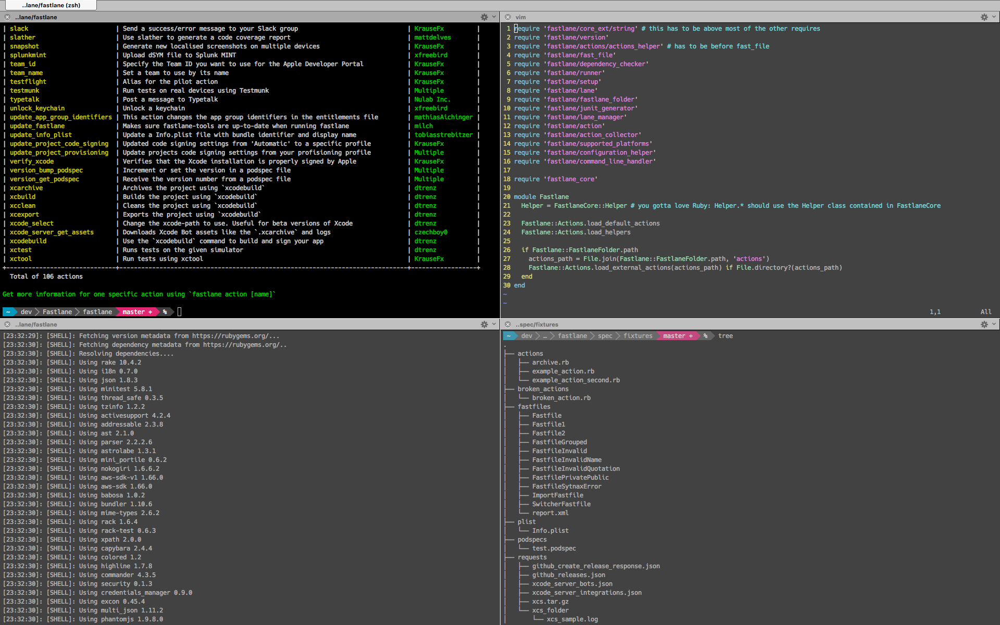

# My terminal configuration

This is the Terminal setup I use on my Macs.

## Installation

Clone the repository and run this script:

    $ install.sh

This will install the prerequisites and create symbolink links to dot files containing configuration information (e.g. `.zshrc`).

The script will set up [powerline-shell](https://github.com/milkbikis/powerline-shell) and will copy the fonts from [powerline-fonts](https://github.com/powerline/fonts).

:warning: In order to use the fonts on OSX, you'll need to open them manually using the Finder or the `open` command.

This installation also contain my `vim` (`.vimrc`) and `git` configurations.

### Terminal setup

You'll now have to set up your terminal with the powerline fonts.

For example, in _iTerm2_, in `Profiles > Text` set _Hack_ as your `Regular font` and _Meslo LG M DZ Regular for Powerline_ as your `Non-ASCII Font`.

In the process, [oh_my_zsh](http://ohmyz.sh/) will also be installed.

## Tools installed

[brew](http://brew.sh/) is **the** package manager for your command-line on OSX.

I also use [homebrew bundler](https://github.com/Homebrew/homebrew-bundle) to use a `brewfile` to list my tools.

I wanted to use [Cask](https://github.com/caskroom/homebrew-cask) here to also install the Apps I use, like [GitUp](http://gitup.co), but you cannot specify arguments to it in a `brewfile` yet.

### Some Brew formula installed

* [trash](http://hasseg.org/trash/): let you send files to the trash from the command-line instead of using the *remorseless* `rm`
* [hub](https://hub.github.com/): useful command-line tool to interact with your GitHub repositories
* [z](https://github.com/rupa/z): quickly access most 'frecent' directory

## Local aliases

Sometimes you need some aliases for you local configuration, so in order to achieve this, the `.zshrc` searches for a `.zsh_custom_aliases` file to load.

## Git configuration

You may have noticed that I use [P4Merge](http://www.perforce.com/product/components/perforce-visual-merge-and-diff-tools) as my `mergetool` git command.
The configuration here expects to find it in `/Applications/p4merge.app`
